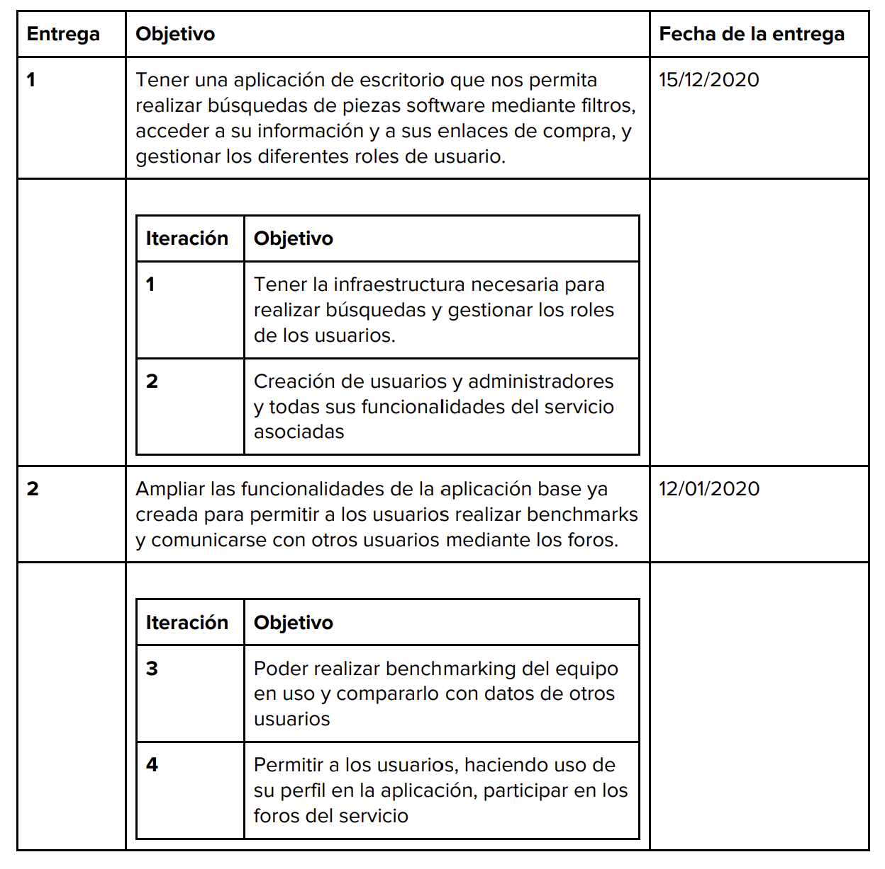
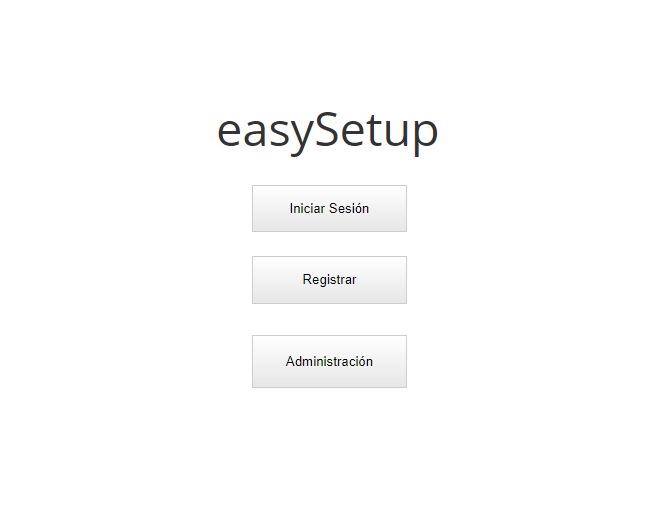
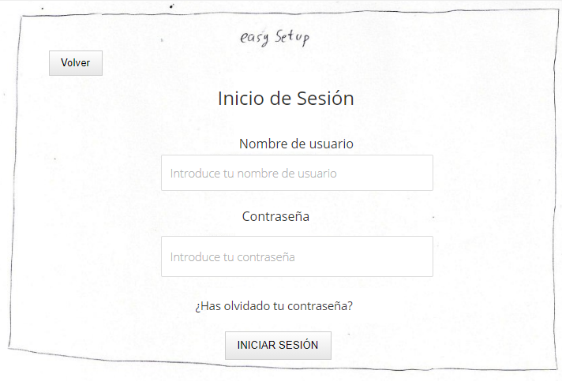
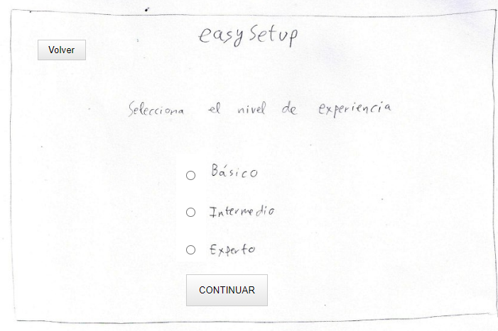
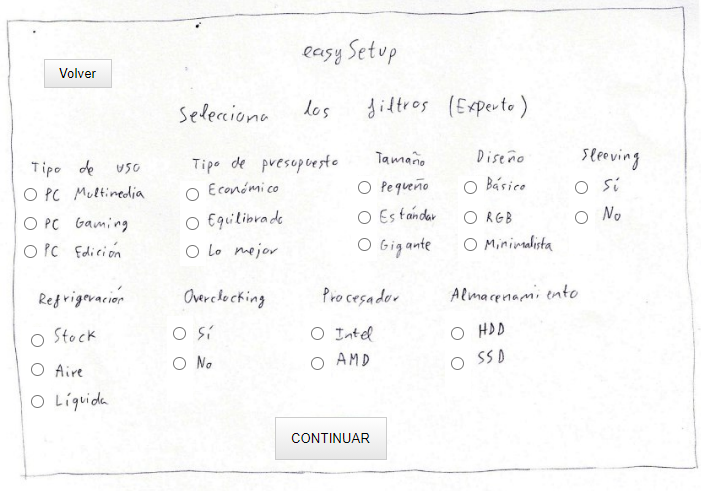
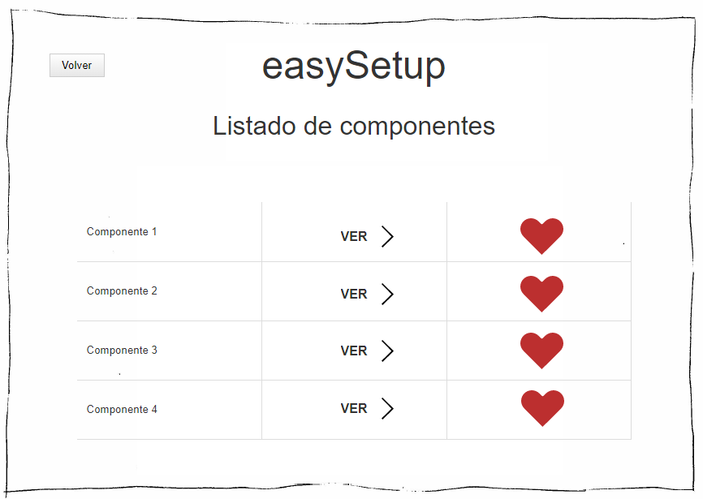
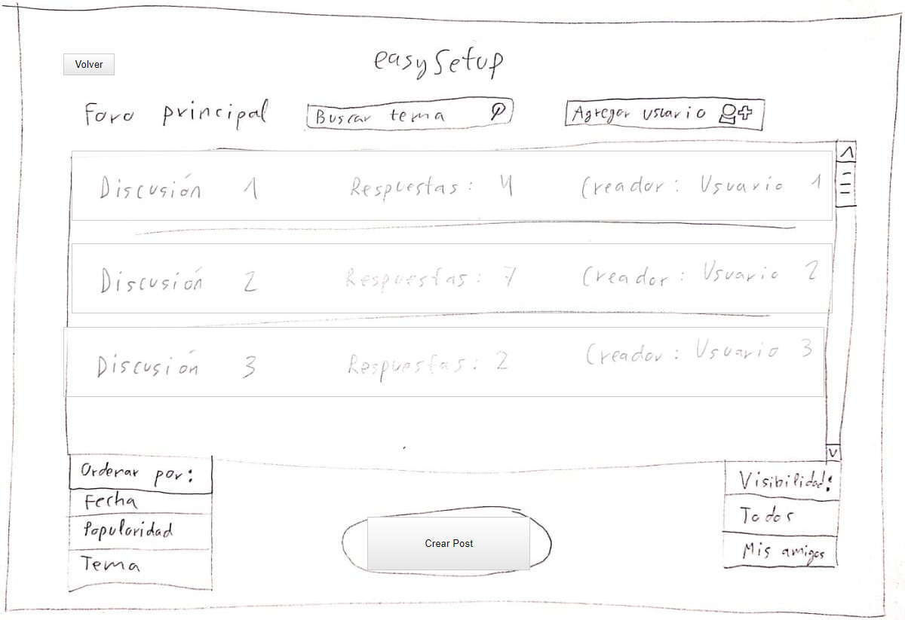

# Proyecto elegido

                                                     
easySetup es una aplicación web destinada a facilitar la compra de ordenadores tanto portátiles como de sobremesa. Ofrecemos diferentes opciones como por ejemplo ofrecer un presupuesto en base a las preferencias del usuario o permitir al usuario limitar un presupuesto. Una vez escogidas todas sus preferencias, se mostrarán las distintas opciones y se ofrecerán posibles tiendas donde comprar dichos componentes o portátiles.

La aplicación cuenta también con un sistema de benchmarking para medir el rendimiento de nuestro equipo y, gracias a este análisis, ofrecernos opciones de compra de componentes determinados para mejorar el rendimiento.

Puedes encontrar más información [aquí](./docs/practica0_1.pdf)

# Mapa Mental

# Personas
Para el desarrollo de este software, hemos utilizado diversas personas para cumplir los requisitos de distintos tipos de usuarios en cuanto a usabilidad y accesibilidad del proyecto.
Las personas creadas son:   

---

    

Teresa Lozano Yung es una mujer de 45 años que trabaja de Gestora de Sistemas Informáticos en un departamento de la ONCE.
Quiere obtener un ascenso en su puesto de trabajo. Para ello, quiere demostrar su valía y mejorar el rendimiento de su equipo de trabajo, optimizando el funcionamiento de los ordenadores que utilizan. 

---

    

Guillermo Nieto tiene 45 años, es Licenciado en Ingeniería de Telecomunicaciones. Usa easySetup con asiduidad para encontrar piezas nuevas y mantener su equipo siempre actualizado.

---

    

Sergi Abelló es un estudiante de 19 años que necesita comprar un nuevo ordenador para recibir clases online.

---

Puedes encontrar más información sobre las personas [aquí](./docs/practica2.pdf)

# Escenarios

**Escenario de Teresa Lozano Yung**

Teresa instala easySetup en todos los equipos de su departamento para realizar un análisis exhaustivo y mejorar en la medida de lo posible el rendimiento general de los ordenadores. Encuentra y configura fácilmente el benchmark con el cual observa que necesita actualizar algunos drivers y solventar algunos fallos de seguridad. Además encontro

---

**Escenario de Guillermo Nieto**

 
Guillermo quiere renovar la RAM de su equipo y sustituir su viejo disco duro HDD por uno SSD. Para ello accede a easySetup y selecciona los filtros en función de sus necesidades (capacidad de la RAM y del SSD entre otras). Gracias a easySetup obtiene exactamente los componentes que necesita, con varios enlaces de distintas tiendas para elegir el que prefiere. 

---

**Escenario de Sergi Abelló**

 
El ordenador portatil de Sergi se ha estropeado y Sergi decide comprar un ordenador. Gracias a sus amigos descrube easySetup. Tras especificar su presupuesto y sus conocimentos de informática puede elegir el equipo con los componentes que quiere, y en poco tiempo recibe el equipo.

# Documento de Visión 
Se crea un documento de visión con todos los aspectos relacionados con la comercialización y explotación de easySetup. Puedes encontrarlo [aquí](https://github.com/marinahbau/easySetup/tree/main/Documentos)
# Plan de entregas del producto
## Velocidad del equipo
Las iteraciones que hemos realizado han tenido una duración de 2 semanas. La estimiación realizada del esfuerzo de cad auna de las historias de usuario se ha expresado en días ideales de programación. En nuestro entorno de trabajo estimamos que un día ideal de programación *(1,6h)* se va a corresponder con 3 o 4 días reales de trabajo.

La duración de una iteración va a ser:

***1 iteración = 2 semanas = 10 días reales***

La Velocidad del equipo de desarrollo medido en punto de historia es:

***5 Programadores * 10 = 50 días reales por iteración => 12 a 16 PH por iteración***

Hemos decidido usar **15 PH** como la velocidad estimada del equipo.

## Descripción de las entregas
Hemos realizado dos entregas:

# Product Backlog
Se ha establecido un product backlog con un total de 30 HU estimadas entre 3 y 1 punto de historia.

|HU|Descripción|Estimación|Iteración|Entrega|
|--|-----------|---------|---------|--------|
|1|Un usuario podrá establecer el nivel de experiencia que tiene con la informática|1|1|1|
|2|Un usuario puede introducir un presupuesto sobre el que obtener su sistema hardware|2|1|1|
|3|Un usuario puede establecer diferentes filtros de búsqueda|3|1|1|
|4|Un usuario puede elegir entre algunas de las configuraciones hardware preestablecidas|2|1|1|
|5|Un usuario puede identificarse como administrador|1|1|1|
|10|Un usuario puede registrarse en el sistema|1|1|1|
|11|Un usuario puede identificarse en el sistema|1|1|1|
|18.1|El sistema debe funcionar al menos para 1000 usuarios concurrentes|4|1|1|
|6|Un administrador puede agregar nuevos productos|2|2|1|
|7|Un administrador puede eliminar productos|2|2|1|
|8|Un administrador puede modificar la información de un producto existente|2|2|1|
|9|Un administrador puede dar de baja a un usuario|3|2|1|
|12|Un usuario puede guardar componentes como favoritos|1|2|1|
|14|Un usuario puede descargar software adicional ligado a cada producto hardware|2|2|1|
|21.1|Un usuario puede añadir método de pago|1|2|1|
|21.2|Un usuario puede modificar método de pago|1|2|1|
|21.3|Un usuario puede eliminar método de pago|1|2|1|
|22.1|Un usuario puede elegir entre los benchmark disponibles|2|3|2|
|22.2|Un usuario puede hacer un benchmark sobre su red|3|3|2|
|22.3|Un usuario puede hacer un benchmark sobre su procesamiento de vídeos|3|3|2|
|22.4|Un usuario puede hacer un benchmark general de su sistema|3|3|2|
|22.5|Un usuario puede compartir el resultado de sus benchmark|2|3|2|
|22.6|Un usuario recibe sugerencias en base a los resultados de sus benchmark|3|3|2|
|15|Un usuario puede crear una discusión en el foro|1|4|2|
|13|Un usuario puede agregar a otro usuario a su lista de amigos|1|4|2|
|16|Un usuario puede comentar en una discusión iniciada por otro usuario|1|4|2|
|17.1|Un usuario puede puntuar un producto en un rango de 1 (más bajo) y 5 (más alto)|3|4|2|
|17.2|Un usuario puede escribir una reseña sobre un producto|3|4|2|
|19.1|Un usuario puede compartir un producto mediante correo electrónico |3|4|2|
|19.2|Un usuario puede compartir un producto mediante redes sociales|3|4|2|

# Desarrollo Scrum

Se ha adoptado la metodología ágil Scrum, donde en cada entrega se han llevado a cabo dos iteraciones de dos semanas cada una.

Durante el desarrollo de cada iteración se ha mantenido un tablero de trello y uno físico para gestionar el avance en el desarrollo, además de reuniones diarias

En cada iteración tras el desarrollo se ha realizado una reunión "Sprint Review" con el Product Owner para repasar los objetivos de la iteración, y otra reunión "Sprint Retrospective" para mejorar la metodología que sigue el equipo

Estas reuniones están documentadas y pueden verse en los documetos adjuntos en cada una de las iteraciones.

# Equipo Scrum

- Product Owner: Román Larrosa Lewandowska, encargado del Product Backlog y de mantener la comunicación entre los stakeholders y el resto del equipo Scrum.
- Scrum Master: Miguel Muñoz Molina. Encargado de mantener el dinamismo y la eficiencia del grupo.
- Equipo de desarrollo: formado por Marina Hernández Bautista, Miguel Ángel Posadas Arraez. Encargados de la implementación y prototipado del proyecto.

## Entrega 1
### **Iteración 1**

 
El objetivo que se ha diseñado para esta primera iteración es tener una aplicación de escritorio que nos permita realizar búsquedas de piezas
software mediante filtros, acceder a su información y a sus enlaces de compra, y gestionar los diferentes roles de usuario.
Esta iteración va a generar un producto entregable hacia el cliente que consistirá en la aplicación y la funcionalidad asociada a la primera
iteración junto a la interfaz de usuario necesaria para el testeo de la misma, a modo de prototipo, tanto en bocetos en papel como en un
prototipo generado con la herramienta Justinmind.

* [Sprint Review](./Documentos/Iteracion1/review.pdf)
* [Sprint Retrospective](./Documentos/Iteracion1/retrospective.pdf)

### **Iteración 2**

 

El objetivo que se ha diseñado para la segunda iteración es añadir a la aplicación de escritorio desarrollada en la primera iteración las
funcionalidades que nos permitan la creación de usuarios y administradores y todas sus funcionalidades del servicio asociadas.
Esta iteración va a generar un producto entregable hacia el cliente que consistirá en la aplicación y la funcionalidad asociada a la segunda
iteración junto a la interfaz de usuario necesaria para el testeo de la misma, a modo de prototipo, tanto en bocetos en papel como en un
prototipo generado con la herramienta Justinmind.

* [Sprint Review](./Documentos/Iteracion2/review.pdf)
* [Sprint Retrospective](./Documentos/Iteracion2/retrospective.pdf)

## Entrega 2
### **Iteración 3**

 
El objetivo que se ha diseñado para esta primera iteración es tener una aplicación de escritorio que nos permita realizar benchmarking al equipo
en el que se ejecuta nuestro sistema.
Esta iteración va a generar un producto entregable hacia el cliente que consistirá en la aplicación y la funcionalidad asociada a la tercera
iteración junto a la interfaz de usuario necesaria para el testeo de la misma, a modo de prototipo, tanto en bocetos en papel como en un
prototipo generado con la herramienta Justinmind.

* [Sprint Review](./Documentos/Iteracion3/review.pdf)
* [Sprint Retrospective](./Documentos/Iteracion3/retrospective.pdf)

### **Iteración 4**

 
El objetivo que se ha diseñado para la cuarta iteración es añadir a la aplicación de escritorio desarrollada en la tercera iteración las
funcionalidades que nos permitan el empleo de la totalidad del foro de la aplicación y la creación y modificación de reseñas de productos
hardware.
Esta iteración va a generar un producto entregable hacia el cliente que consistirá en la aplicación y la funcionalidad asociada a la cuarta iteración
junto a la interfaz de usuario necesaria para el testeo de la misma, a modo de prototipo, tanto en bocetos en papel como en un prototipo
generado con la herramienta Justinmind.

* [Sprint Review](./Documentos/Iteracion4/review.pdf)
* [Sprint Retrospective](./Documentos/Iteracion4/retrospective.pdf)

# Demostraciones del funcionamiento
## **Home**

## **Login**

## **Experiencia**

## **Filtros avanzados**

## **Listado de componentes**

## **Listado de foros**
