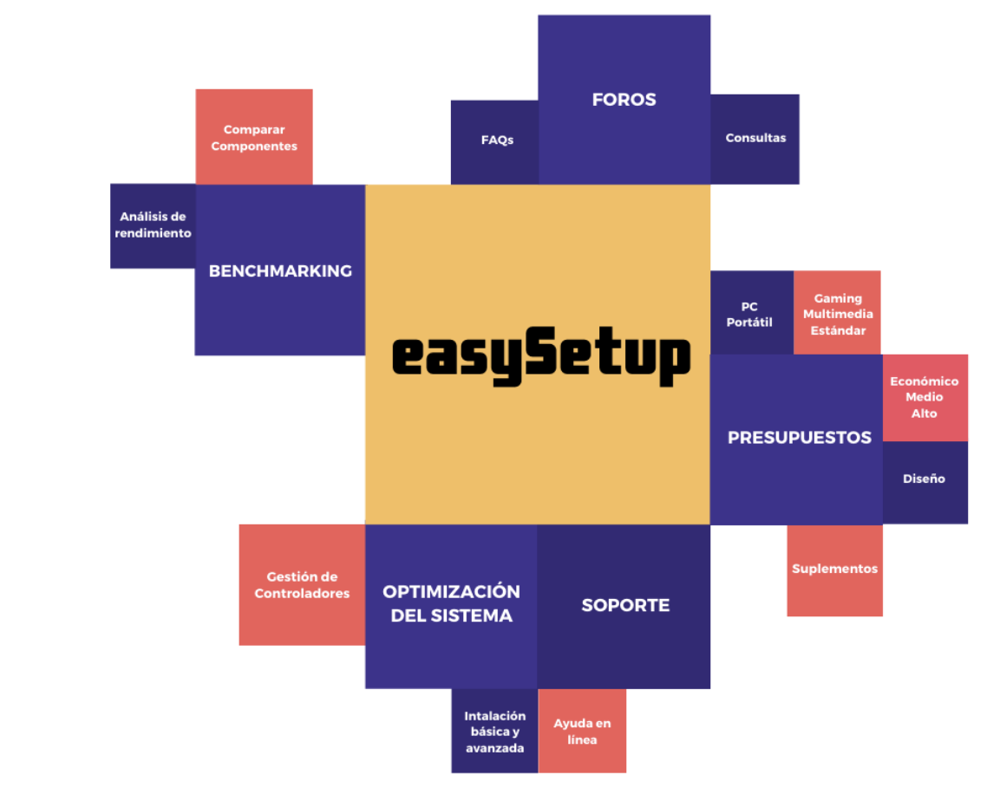

title: easySetup
description: Una única aplicación para comparar tu hardware, descubrir piezas nuevas, conocer gente con tus intereses y mantener tu equipo a punto con los últimos controladores y actualizaciones

# Proyecto elegido

easySetup es una aplicación web destinada a facilitar la compra de ordenadores tanto portátiles como de sobremesa. Ofrecemos diferentes opciones como por ejemplo ofrecer un presupuesto en base a las preferencias del usuario o permitir al usuario limitar un presupuesto. Una vez escogidas todas sus preferencias, se mostrarán las distintas opciones y se ofrecerán posibles tiendas donde comprar dichos componentes o portátiles.

La aplicación cuenta también con un sistema de benchmarking para medir el rendimiento de nuestro equipo y, gracias a este análisis, ofrecernos opciones de compra de componentes determinados para mejorar el rendimiento.

# Mapa Mental

# Personas
Para el desarrollo de este software, hemos utilizado diversas personas para cumplir los requisitos de distintos tipos de usuarios en cuanto a usabilidad y accesibilidad del proyecto.
Las personas creadas son:
